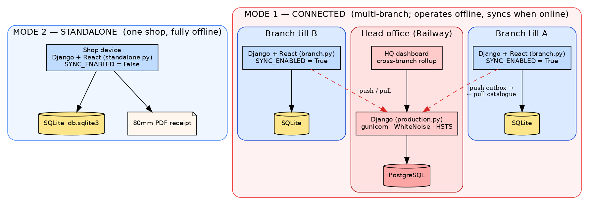
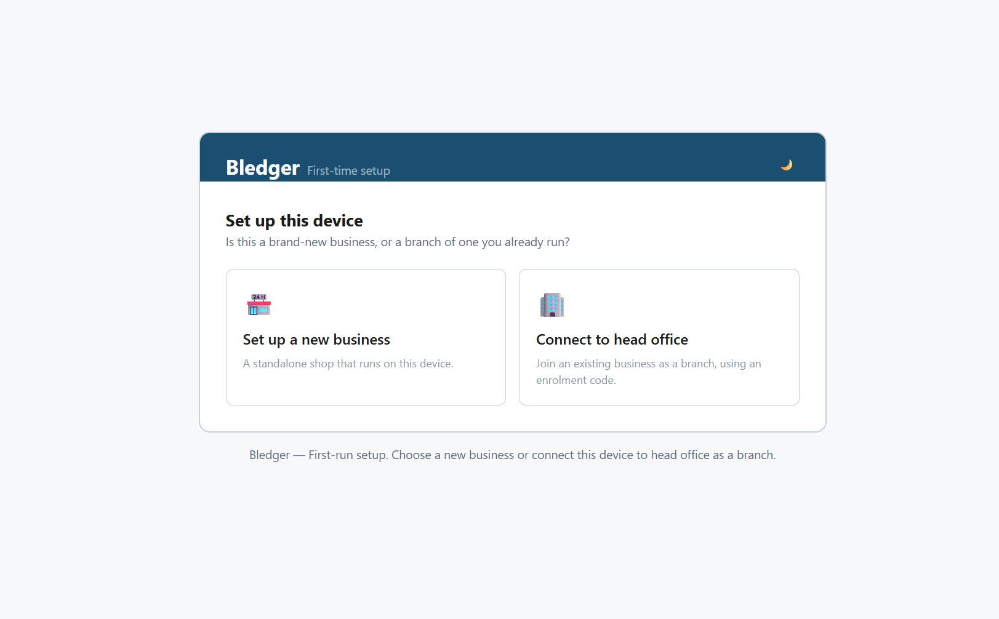
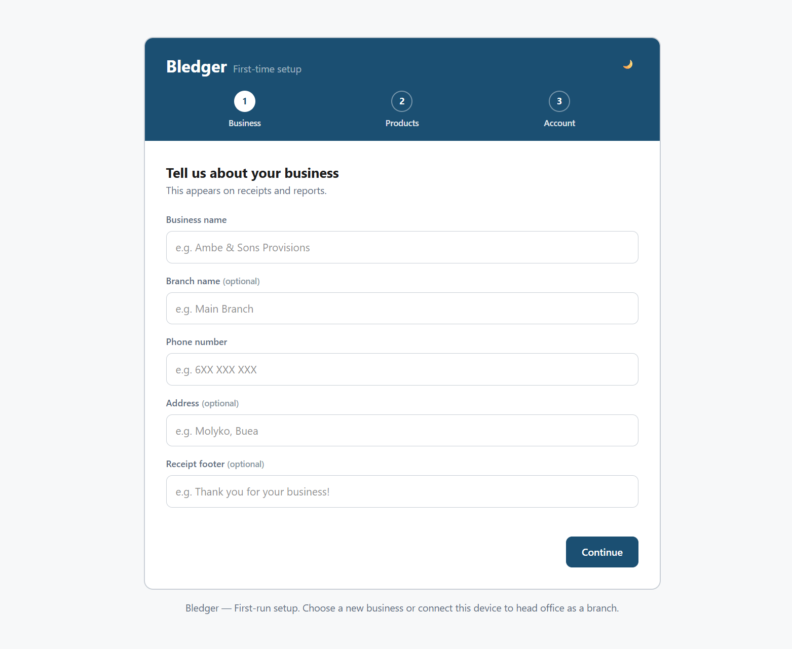
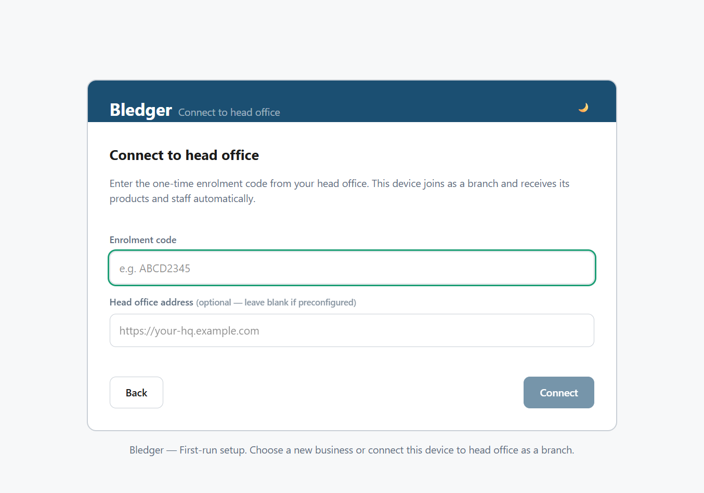

# Bledger — Setup & Deployment Guide

This is the operational guide for **installing and running Bledger**. It covers
both deployment modes end to end:

- **Mode 2 — Standalone:** one shop, one device, SQLite, fully offline. No cloud.
- **Mode 1 — Connected:** a central cloud (PostgreSQL on Railway) plus one or
  more branch devices (each SQLite, syncing when online).

Audience: the developer or IT person setting up an install. Every command is
runnable; every environment variable is named.

---

## 1. Mental model — what runs where



*Figure 1 — Standalone is a single self-contained device. Connected is a cloud
receiver plus independent branch tills that push their outbox up and pull the
catalogue down.*

| Piece | Deployment | Database | Settings module |
|---|---|---|---|
| **Standalone install** | On-site device, offline | SQLite | `bledger.settings.standalone` |
| **Branch device** (Mode 1) | On-site device at the shop | SQLite | `bledger.settings.branch` |
| **Head office / cloud** (Mode 1) | Hosted (Railway) | PostgreSQL | `bledger.settings.production` |

Only the **cloud** is a hosted service. Standalone and branch devices run
locally, keep working offline, and (branch only) sync when they can. The cloud
is a *receiver* of pushes and a *server* of catalogue pulls — it does not run the
sync loop itself.

The active settings module is chosen by the `DJANGO_SETTINGS_MODULE` environment
variable — **not** by anything in `.env`. `.env` supplies the values each module
reads. Copy `.env.example` to `.env` and fill it in.

---

## 2. Prerequisites

- **Python 3.12+** (Django 6.0 requires it).
- **Node 20+** (to build the frontend).
- For PDF receipts/reports: WeasyPrint's system libraries — **Pango, Cairo,
  GDK-PixBuf**. Without them the app still runs; only the print/export endpoints
  return a clear 503.
- Mode 1 cloud only: a **Railway** account (or any host that can run Django +
  PostgreSQL) and a **PostgreSQL** database.

---

## PART A — Standalone install (Mode 2)

A single shop on a single device, fully offline. This is also the configuration
that ships inside the Phase 3 Tauri desktop bundle.

### A1. Get the code and build the frontend

```bash
git clone <repo> bledger && cd bledger
cd frontend
npm install
npm run build          # emits static assets into frontend/dist/
cd ..
```

### A2. Configure the backend

```bash
cd backend
python -m venv .venv && source .venv/bin/activate
pip install -r requirements/base.txt
cp ../.env.example ../.env
```

Edit `.env` for a standalone install:

```
DEPLOYMENT_MODE=standalone
DJANGO_SECRET_KEY=<a long random secret>
DJANGO_DEBUG=False
DJANGO_ALLOWED_HOSTS=localhost,127.0.0.1
SQLITE_PATH=db.sqlite3
BRANCH_ID=HQ
PRINTER_BACKEND=pdf
```

`standalone.py` reads only `SQLITE_PATH`; it forces `SYNC_ENABLED=False` and
never touches PostgreSQL or any cloud.

### A3. Migrate and run

```bash
export DJANGO_SETTINGS_MODULE=bledger.settings.standalone
python manage.py migrate
python manage.py runserver 0.0.0.0:8000
```

Serve the built frontend however suits the device — the simplest option is to
point a static server at `frontend/dist/` and reverse-proxy `/api/*` to the
Django process on `:8000`. (In Phase 3 the Tauri shell packages both together.)

### A4. First-run setup

Open the app in a browser. The first run asks whether this is a new business or a
branch; choose **Set up a new business** for a standalone install.



The **3-step setup wizard** then runs once and creates the `Branch` (business
name, code, receipt footer), optionally loads a starter product template, and
creates the **owner** account. After that the app always opens at the login
screen. There is nothing else to configure — the shop can trade immediately,
with or without internet.



### A5. Verify

```bash
curl http://localhost:8000/api/v1/health/
```

Record a test sale, print/download its 80mm PDF receipt, and confirm stock
decremented. Done — a standalone shop needs no further steps.

---

## PART B — Connected cloud (Mode 1): deploy the head office

The cloud is the central PostgreSQL + Django service that aggregates all
branches. These steps use Railway; any Django-capable host works with the same
settings module and env vars.

### B1. Provision PostgreSQL

Add the **PostgreSQL** plugin to the Railway project. Railway injects
`DATABASE_URL` automatically; `connected.py` prefers it over the discrete
`POSTGRES_*` vars.

### B2. Point Railway at the backend

The Django app lives in `backend/`. Set the service **Root Directory** to
`backend`. `backend/railway.json` then drives build and deploy:

- **build:** `pip install -r requirements/prod.txt && python manage.py collectstatic --no-input`
- **preDeploy:** `python manage.py migrate --no-input`
- **start:** `gunicorn bledger.wsgi:application --bind 0.0.0.0:$PORT --workers 3`
- **healthcheck:** `/api/v1/health/`

(A `Procfile` with the same `web` and `release` commands is included for
Heroku-style hosts.)

### B3. Environment variables (cloud)

Set these on the Railway service:

```
DJANGO_SETTINGS_MODULE=bledger.settings.production
DJANGO_SECRET_KEY=<a long random secret>
DEPLOYMENT_MODE=connected
BRANCH_ID=HQ
DJANGO_ALLOWED_HOSTS=<your-app>.up.railway.app
DJANGO_CSRF_TRUSTED_ORIGINS=https://<your-app>.up.railway.app
DJANGO_CORS_ALLOWED_ORIGINS=https://<your-app>.up.railway.app
# DATABASE_URL is injected by the Postgres plugin
# SENTRY_DSN=<optional>
```

`production.py` inherits `connected.py` and adds `SECURE_SSL_REDIRECT`, HSTS,
secure cookies, `SECURE_CONTENT_TYPE_NOSNIFF`, WhiteNoise static serving, and
`SECURE_PROXY_SSL_HEADER = ("HTTP_X_FORWARDED_PROTO", "https")` — the last of
which prevents a redirect loop, since Railway terminates TLS at its edge. Sentry
is wired in only if `SENTRY_DSN` is set.

### B4. First deploy

Trigger a deploy. The preDeploy step runs migrations, creating all Phase 1 +
Phase 2 tables (including `sync_enrolmentcode`, `sync_appliedentry`,
`sync_syncstate`). Confirm:

```bash
curl https://<your-app>.up.railway.app/api/v1/health/
```

### B5. Create the head-office branch + owner

Run once (Railway shell, or `railway run`):

```bash
python manage.py createsuperuser     # optional, for Django /admin/

python manage.py shell -c "
from apps.auth_users.models import Branch, BledgerUser
b = Branch.objects.create(business_name='Tabi Provisions', branch_name='Head Office',
                          code='HQ', is_hq=True, deployment_mode='connected', setup_complete=True)
BledgerUser.objects.create_user(username='owner', branch=b, role='owner',
                                password='<strong password>', name='Owner')
print('HQ branch', b.id)
"
```

> Marking HQ with `is_hq=True` makes the HQ dashboard attribute HQ's own sales
> correctly. If you used the setup wizard instead (it defaults `is_hq=False`),
> fix it after: `Branch.objects.filter(code='HQ').update(is_hq=True)`.

---

## PART C — Connected: enrol a branch device

Each branch runs its own copy of Bledger in **branch** mode. Enrolment gives that
device a cloud identity + sync token.

### C1. On the CLOUD — provision the branch, get a one-time code

```bash
python manage.py provision_branch --branch-name "Limbe Branch" --code LMB
```

Prints a one-time **enrolment code** (default validity 7 days) and the command to
run on the device. This is the CLI equivalent of the owner-only
`POST /api/v1/sync/branches/` endpoint (also reachable from the HQ dashboard's
**"+ Add branch"** button, which reveals the code).

### C2. On the DEVICE — configure branch mode

Install Bledger on the branch machine (frontend build + backend, as in Part A),
then set `.env`:

```
DJANGO_SETTINGS_MODULE=bledger.settings.branch
DEPLOYMENT_MODE=connected
CLOUD_API_BASE_URL=https://<your-app>.up.railway.app
SQLITE_PATH=db.sqlite3
SYNC_PUSH_INTERVAL_SECONDS=30
```

Run migrations: `python manage.py migrate`.

### C3. On the DEVICE — redeem the code

```bash
python manage.py enrol_device --code <CODE_FROM_C1>
```

This calls `/api/v1/sync/enrol/`, consumes the code, and writes the returned
`branch_id` (as `cloud_id`), device `sync_token`, and branch config into the
device's local `Branch` row. From here `DeploymentContextMiddleware` stamps the
cloud-assigned `branch_id` on every record. The setup wizard's **"Connect to
head office"** path does the same thing from the UI — enter the one-time code
(and optionally the head-office address if it isn't preconfigured):



### C4. On the DEVICE — schedule the sync loop

Point cron at the combined push+pull cycle. It is safe to run frequently — it
self-limits via a run lock and exponential backoff:

```
* * * * *  cd /path/to/backend && python manage.py sync
```

For sub-minute cadence, run a small loop that calls `manage.py sync` every ~30s.
Watch health with `GET /api/v1/sync/status/`, the in-app **sync badge**, or the
owner **Sync health** screen.

---

## PART D — Verify end-to-end (connected)

1. On the device, record a sale. `/sync/status/` shows `pending: 1`.
2. After a sync cycle it shows `pending: 0`, `connectivity: synced`, and the
   reconnection toast fires.
3. On the cloud, the owner's **HQ dashboard** shows the branch with its revenue
   and a fresh "last synced" time.
4. Edit the catalogue at HQ; on the next device pull, the change (and any
   discontinued-product tombstones) appears in the branch's inventory.

> *Screenshot to add: the HQ dashboard's per-branch table with totals and
> last-seen times — capture from a running connected multi-branch instance.*

---

## 3. Environment variable reference

| Variable | Used by | Meaning |
|---|---|---|
| `DJANGO_SETTINGS_MODULE` | all | Selects the run shape: `standalone` / `branch` / `production` |
| `DEPLOYMENT_MODE` | `core.middleware` | `standalone` \| `connected` — tags requests/responses |
| `DJANGO_SECRET_KEY` | all | Django secret; long and random in production |
| `DJANGO_DEBUG` | all | `False` in any real deployment |
| `DJANGO_ALLOWED_HOSTS` | all | Comma list of hostnames the app answers on |
| `SQLITE_PATH` | standalone, branch | Path to the local SQLite file |
| `BRANCH_ID` | all | Fallback branch id; overridden by the enrolled branch on a device |
| `PRINTER_BACKEND` | printing | `pdf` now; `thermal` is the Phase 3 stub |
| `DATABASE_URL` | connected/production | Injected by Railway Postgres; preferred over `POSTGRES_*` |
| `POSTGRES_DB/USER/PASSWORD/HOST/PORT` | connected/production | Discrete Postgres config if no `DATABASE_URL` |
| `DJANGO_CSRF_TRUSTED_ORIGINS` | production | HTTPS origin(s) of the cloud |
| `DJANGO_CORS_ALLOWED_ORIGINS` | connected/production | Allowed browser origins |
| `CLOUD_API_BASE_URL` | branch | Base URL of the head office this device syncs against |
| `SYNC_PUSH_INTERVAL_SECONDS` | branch/connected | Sync cadence hint (default 30) |
| `ENROLMENT_CODE_TTL_DAYS` | branch | Enrolment-code validity (default 7) |
| `SENTRY_DSN` | production | Optional error reporting |

---

## 4. Notes, rollback & troubleshooting

- **Migrations** run in the preDeploy/release step; a failed migration fails the
  deploy **before** traffic shifts. To roll back, redeploy the previous commit.
- **Branch devices are resilient to cloud downtime:** writes queue in the outbox
  and drain on reconnect. All 4xx/5xx from the cloud are treated as transient, so
  queued writes are never dropped.
- **Rejected pushes** are visible to the owner on the **Sync health** screen
  (`rejected_at` + reason) — they never silently vanish.
- **PDF endpoints return 503?** WeasyPrint's system libraries are missing. Install
  Pango/Cairo/GDK-PixBuf; the rest of the app is unaffected in the meantime.
- **Redirect loop on the cloud?** Confirm `SECURE_PROXY_SSL_HEADER` is in effect
  (it is, in `production.py`) and that you're on `production`, not `connected`.
- **CSRF 403 on login/setup ("CSRF token missing" or "Origin checking
  failed")?** DRF enforces CSRF only via `SessionAuthentication`, which kicks in
  when a Django `sessionid` cookie is present (the login endpoints call
  `django_login()`, and `/admin/` sets one too). The credential endpoints
  (`login`, `pin-login`, `setup`) set `authentication_classes = []` so they never
  run session auth — if you add a new pre-token public endpoint, do the same.
  Separately, any genuinely session-authenticated browser POST also needs its
  origin in `CSRF_TRUSTED_ORIGINS`: dev already trusts
  `http://localhost:5173` / `http://127.0.0.1:5173`; on the cloud set
  `DJANGO_CSRF_TRUSTED_ORIGINS=https://<your-app>.up.railway.app`. This is
  separate from `CORS_ALLOWED_ORIGINS` — you generally need **both**. Token-auth
  requests (`Authorization: Token …`) are never affected.

## 5. Known follow-ups (tracked in project notes)

- Standalone → connected migration for an existing shop *with history* is unbuilt
  (the greenfield branch-enrolment path is done).
- Branch `BledgerUser` + descriptive business-config pull (catalogue +
  `BusinessSettings` pull is done).
- Verify the `django.tasks` worker path on real Django 6.0 (the cron path is the
  tested one).
