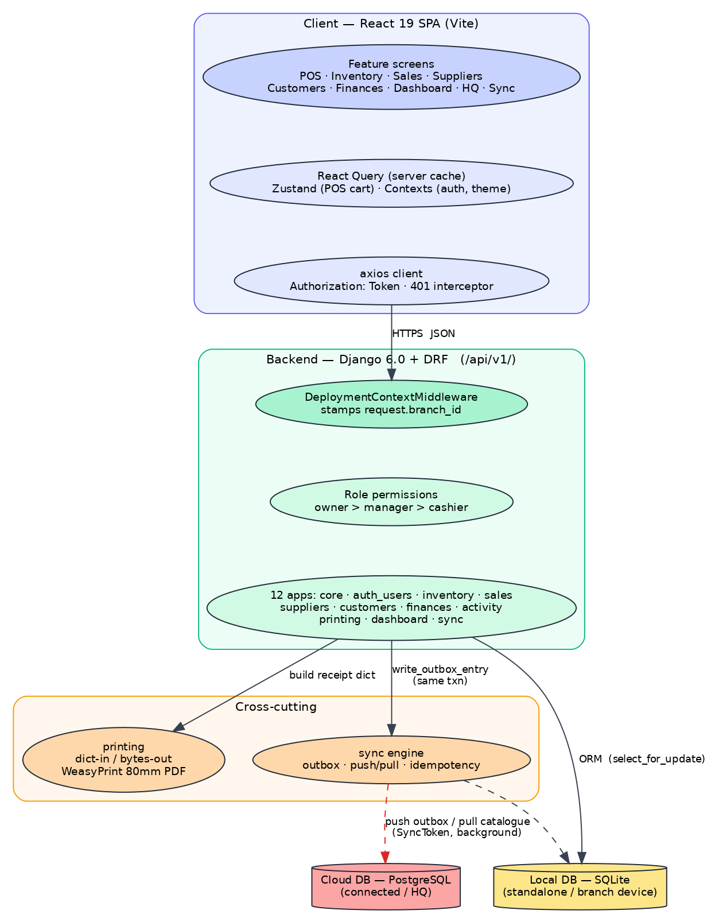
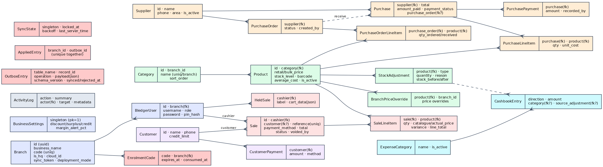
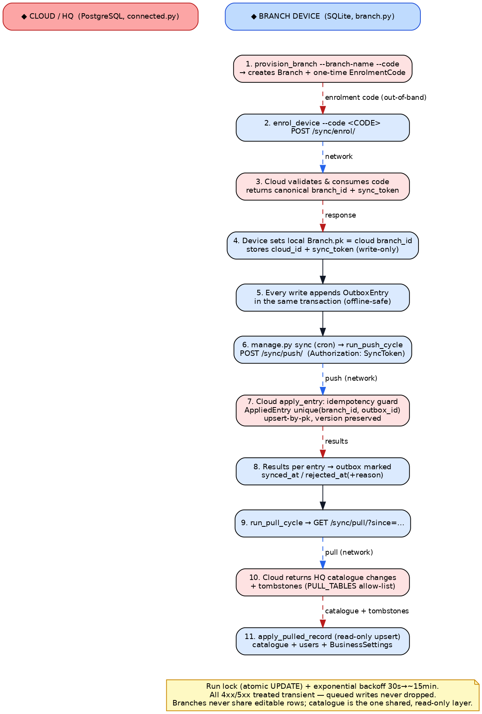
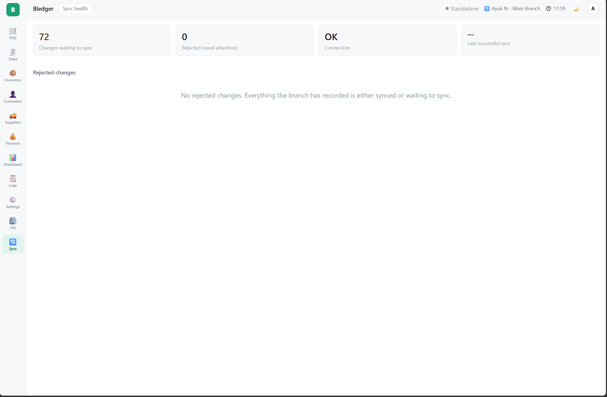

# Bledger — Developer Guide

Django 6.0 + React (Vite) business-management / POS system for Anglophone
Cameroonian SMEs. **Standalone-first**: SQLite, fully offline. An additive
**connected / multi-branch** layer replicates each branch to a central cloud.

> **Status: Phase 1 + all of Phase 2 (Stages 1–4) shipped.** Standalone Phase 1
> was untouched throughout; connected mode and every Phase 2 feature are
> additive. The backend is 12 apps; the sync engine is complete (push, pull,
> enrolment, idempotency); customers/credit, finances, activity logging,
> purchase orders, barcode, and the HQ dashboard are all live.

Design references (in project knowledge): `Bledger_Design_v0.5.docx`,
`Bledger_Feasibility_Design_v0.3.docx`, `PHASE2_DESIGN.md`, and
`Bledger_UI_Design_Reference.docx` — the **screen-level implementation
baseline**. Check the UI reference before building or modifying any documented
screen; live-project customisations win over the doc for anything already built.

---

## 1. Getting started

**Requirements:** Python **3.12+** (Django 6.0 requires it), Node **20+**.

### Backend

```bash
cd backend
python -m venv .venv && source .venv/bin/activate
pip install -r requirements/dev.txt
cp ../.env.example ../.env          # then edit as needed
export DJANGO_SETTINGS_MODULE=bledger.settings.development
python manage.py migrate
python manage.py runserver
```

### Frontend

```bash
cd frontend
npm install
npm run dev          # Vite dev server, proxies /api/* to :8000
npm run lint         # oxlint
npm run build
```

Open the app and complete the first-run setup wizard to create your business and
owner account.

### Tests

```bash
cd backend
DJANGO_SETTINGS_MODULE=bledger.settings.testing pytest
```

> Receipt/report PDF endpoints need WeasyPrint's system libraries (Pango, Cairo,
> GDK-PixBuf). If absent, those endpoints return **503** with a clear message —
> the rest of the app is unaffected (the import is lazy and failure-tolerant).

---

## 2. System architecture

One codebase, one API, three run shapes. The React SPA talks to a Django + DRF
API under `/api/v1/`. Every request is stamped with a `branch_id` by
middleware; every mutation writes locally first and appends an outbox entry in
the same transaction. In connected mode a background sync engine drains that
outbox to the cloud and pulls the shared catalogue back down.



*Figure 1 — Client, API, cross-cutting services, and the two database targets.*

---

## 3. Deployment modes & settings modules

Three settings modules cover the three run shapes. All inherit `base.py`.

| Module | Database | `SYNC_ENABLED` | Role |
|---|---|---|---|
| `development` | SQLite | False | Local dev; CORS open to the Vite dev server |
| `standalone` | SQLite | False | **Mode 2** — single-shop production, fully offline |
| `branch` | SQLite | **True** | **Mode 1** — a branch till: local SQLite, sync on |
| `connected` | PostgreSQL | True | **Mode 1** — the cloud/HQ server |
| `production` | PostgreSQL | True | Inherits `connected` + WhiteNoise/HSTS/Sentry/proxy-SSL |
| `testing` | in-memory SQLite | False | Fast test runs |

The load-bearing property in every mode: **no user action ever waits on the
network.** Connectivity affects *when* data replicates, never *whether* a
cashier can complete a sale. Server setup for each mode is in
[`DEPLOYMENT.md`](DEPLOYMENT.md).

---

## 4. Backend layout — 12 apps

All apps live under `backend/apps/` and are mounted in `bledger/urls.py` under
`/api/v1/`. TokenAuthentication (`Authorization: Token <key>` — not Bearer);
session auth is kept alongside for `/admin/`.

| App | Owns | Key endpoints |
|---|---|---|
| `core` | `BaseModel`, permissions, pagination, `DeploymentContextMiddleware`, XAF helpers, health check | `GET /health/` |
| `auth_users` | `Branch`, `BledgerUser`, `BusinessSettings`, setup wizard | `POST /auth/login/`, `/auth/pin-login/`, `/auth/logout/`, `/auth/verify-pin/`, `GET /auth/me/`; `GET /setup/status/`, `/setup/templates/`, `POST /setup/`, `/setup/load-template/`; `/users/` (+ `POST {id}/reset-pin/`); `/settings/business/`, `/settings/preferences/` |
| `inventory` | `Category`, `Product`, `BranchPriceOverride`, `StockAdjustment`, `ProductTemplate` | `/products/`, `/categories/`, `/price-overrides/` (upsert-on-create), `/stock-adjustments/` (append-only) |
| `sales` | `Sale`, `SaleLineItem`, `HeldSale`, receipt context | `/sales/` (+ `?date_from&date_to&payment_method&status&search`), `POST /sales/{id}/void/`, `GET /sales/{id}/receipt/` (PDF), `/held-sales/` (+ `POST {id}/restore/`) |
| `suppliers` | `Supplier`, `Purchase`, `PurchaseLineItem`, `PurchasePayment`, `PurchaseOrder`, `PurchaseOrderLineItem` | `/suppliers/`, `/purchases/` (+ `POST {id}/record-payment/`), `/purchase-orders/` (+ `send`/`cancel`/`receive`) |
| `customers` | `Customer`, `CustomerPayment` | `/customers/` (+ balance, ledger, aged-debt actions) |
| `finances` | `ExpenseCategory`, `CashbookEntry` | `/finances/expense-categories/`, `/finances/cashbook/`, `GET /finances/pnl/` |
| `activity` | `ActivityLog` | `/activity/` |
| `printing` | Printer abstraction, `receipt.html` (80mm), PDF backend | *(no routes — called by sales/dashboard)* |
| `dashboard` | Aggregate reads + CSV/PDF reports + HQ rollup | `/dashboard/summary/`, `/top-products/`, `/payment-breakdown/`, `/sales-chart/`, `/variance-summary/`, `/margin-summary/`, `/stock-valuation/`, `/low-margin/`, `/brokered-summary/`, `/stock-alerts/`; `GET /hq/summary/`; `/reports/{sales,products,stock}/?export=csv\|pdf` |
| `sync` | Full engine: `OutboxEntry`, `EnrolmentCode`, `AppliedEntry`, `SyncState` | `/sync/enrol/`, `/connect/`, `/branches/`, `/push/`, `/pull/`, `/status/`, `/health/` |

> **`?export=` not `?format=`.** `?format=` is reserved by DRF; report exports
> use `?export=csv|pdf`.

---

## 5. Data model

`BaseModel` (`apps/core/models.py`) backs every synced table: UUID pk,
`branch_id`, `created_at/updated_at`, soft delete (`deleted_at` +
`SoftDeleteManager`), `synced_at`, and `version` (auto-incremented in `save()`).
Deliberate exceptions — auth and infrastructure models with their own lifecycle:
`Branch`, `BledgerUser`, `BusinessSettings`, `OutboxEntry`, `EnrolmentCode`,
`AppliedEntry`, `SyncState`, `ProductTemplate`.



*Figure 2 — Core entities across the 12 apps. Blue = identity/auth,
green = inventory, red = sales, orange = suppliers/purchasing,
purple = customers, cyan = finances, pink = sync.*

Notes worth knowing:

- **Money is XAF as `PositiveIntegerField` everywhere — never `Decimal`.**
  Formatting/rounding lives only in `apps/core/utils/xaf.py` (`round_xaf`
  returns `int`); the frontend uses the `XAFAmount` component.
- **`SaleLineItem` records `catalogue_price`, `actual_price`, and `variance`**
  on every line — negotiated pricing (*marchandage*) needs no migration. It also
  carries `unit_cost_at_sale` and brokerage fields for margin/brokered reporting.
- **`Sale.reference`** is `BLD-<branch_code>-<year>-<seq>`, derived from the most
  recent reference and retried on `IntegrityError` (the column is unique) — so
  branches don't collide in a shared database.
- **`Product`** carries `average_cost`/`last_cost`/`cost_is_set` (margin
  reporting), `barcode` (unique per branch, scanning), and optional per-product
  `discount_floor_pct`/`surplus_ceiling_pct` (negotiated-pricing policy).
- **`BusinessSettings`** is a singleton (pk pinned to 1) holding business-wide
  *policy* (discount floor, surplus ceiling, credit limit, margin alerts).
  Kept separate from `Branch` (*identity*) so policy can become HQ-owned and
  pushed read-only once multi-branch is live.

---

## 6. The sync engine (`apps/sync`)

Sync is **one-way-per-record + one shared pull layer**. Branches never share
editable rows; the only shared layer is the HQ catalogue, pulled down read-only.



*Figure 3 — Enrolment, outbox push, and catalogue pull between a branch device
and the cloud.*

**Models.** `OutboxEntry` (append-only queue, `+ rejected_at`),
`EnrolmentCode` (one-time device redemption), `AppliedEntry` (cloud-side
idempotency ledger), `SyncState` (singleton: run lock, backoff,
`last_server_time`).

**Enrolment (§2.3).** A device redeems a one-time `EnrolmentCode` and receives a
canonical `branch_id` + device `sync_token`. **The device's local `Branch`
primary key is set to the cloud `branch_id`** so pulled records (e.g.
`BledgerUser.branch_id`) resolve locally. From then on
`DeploymentContextMiddleware` resolves `request.branch_id` from the enrolled
`Branch.cloud_id` when `SYNC_ENABLED`, falling back to `settings.BRANCH_ID`
(guarded so standalone and the cloud server are unaffected).

**Auth.** Device sync token — `Authorization: SyncToken <token>`
(`DeviceSyncTokenAuthentication` + `IsEnrolledDevice`). Sync runs with **no user
logged in**.

**Engine (`engine.py`).** `run_push_cycle` / `run_pull_cycle` /
`run_sync_cycle` — each takes a DB run-lock (atomic conditional UPDATE,
SQLite-safe), applies exponential backoff (30s → ~15min), and returns per-entry
outcomes. `cloud_client.py` is a stdlib-`urllib` `CloudClient`; **all 4xx/5xx
are treated as transient** (`TransientSyncError`) — queued writes are never
dropped.

**Apply (`apply.py`).** Idempotency is mandatory: cloud `AppliedEntry` is unique
on `(branch_id, outbox_id)`, checked inside the applying transaction. **Apply =
upsert-by-pk with `version` preserved (never bumped)**; DELETE is a soft-delete
tombstone applied by the same upsert. Push-apply is **registry-gated**;
pull-apply uses a `PULL_TABLES` allow-list (catalogue + `BledgerUser` +
`BusinessSettings`), bypassing the push gate because those auth tables are
push-excluded but legitimately pulled.

**Trigger.** `django.tasks` is the background mechanism, but the **tested trigger
is `manage.py sync` from cron** (immediate TASKS backend + cron is the shipped
path; a worker is optional). Management commands: `sync`, `sync_push`,
`sync_pull`, `provision_branch` (cloud), `enrol_device` (device).

**`registry.py`** declares `SYNCED_TABLES` / `NEVER_SYNCED` /
`SYNC_RETENTION_DAYS`; a test fails the build if a new `BaseModel` is left
unclassified. `serialize_instance()` applies per-type rules and
`OutboxEntry.schema_version` records the contract each entry was written against.

Watch health with `GET /sync/status/` (any staff), the in-app **sync badge**, or
the owner **Sync health** screen (`GET /sync/health/` — rejected-with-reasons +
backlog).



*The owner **Sync health** screen (`/sync-health`): changes waiting to sync,
rejected-with-reasons, connection state, and last successful sync.*

---

## 7. Permission model

`apps/core/permissions.py`: `IsOwner`, `IsManagerOrOwner`, `IsCashierOrAbove` —
rank-based (`owner > manager > cashier`), deny-by-default if `role` is absent.

- **Inventory:** read = cashier+, write = manager+.
- **Sales:** cashier+, but cashiers see only their own sales/held sales;
  `void` is manager+.
- **Suppliers / purchases / purchase orders:** entire area manager+ (unit costs
  are financial data cashiers never see).
- **Finances:** manager+.
- **Dashboard:** manager+ **except** `stock-alerts` (cashier+, per design doc
  E.5); `hq/summary` is owner-only.

---

## 8. Cross-cutting write conventions

- **Stock never moves via direct field edits.** Only four code paths touch
  `Product.stock_level`: `StockAdjustmentSerializer.create()`,
  `SaleSerializer.create()` (decrement), `VoidSaleSerializer.save()` (restore),
  and `PurchaseSerializer.create()` (increment) — always `select_for_update()`
  inside `transaction.atomic()`, with an outbox write in the same transaction.
  A purchase order **never** touches stock; receiving reuses
  `PurchaseSerializer`, the single stock-moving path.
- **Financial records are immutable.** `Sale` and `Purchase` have no
  PATCH/DELETE; corrections happen through purpose-built actions (`/void/`,
  `/record-payment/`) that append audit records.
- **Totals are server-computed.** `Sale.subtotal/total_amount`,
  `Purchase.total_amount/payment_status` are never client-supplied.
- **Branch scoping.** Every viewset filters by `request.branch_id` via a
  `BranchScopedQuerysetMixin`; `ProductViewSet` additionally unions in the HQ
  catalogue (`branch_id="HQ"`) — the multi-branch seam.
- **Soft delete** via `BaseModel.soft_delete()`; `HeldSale.restore`
  hard-deletes deliberately (transient data). Products deactivate
  (`is_active=False`) instead of any delete, so historical receipts stay correct.
- **Every `DefaultRouter` sets `include_format_suffixes = False`** — a second
  router registering the process-wide format-suffix converter raises under
  Django 6's stricter `register_converter()`.
- **Outbox on every mutation.** New synced models inherit `BaseModel`, add
  `apps.sync.utils.write_outbox_entry()` in the same transaction as every
  mutation, and declare themselves in `apps/sync/registry.py`.

---

## 9. Frontend layout

`frontend/` — React 19, Vite, React Query (`@tanstack/react-query`), Zustand
(cart), React Hook Form, Tailwind, oxlint.

```
src/
  api/         axios client + one module per backend app
  hooks/       React Query wrappers (useProducts, useSuppliers, useSyncStatus, ...)
  context/     AuthContext (token + role), ThemeContext (dark mode)
  store/       cartStore.js (Zustand — POS cart)
  components/  shared: RoleGuard, NavRail, ScreenTopbar, SyncStatusBadge,
               SyncToastHost, ToastStack, XAFAmount, CameraScanModal, ...
  features/    one folder per screen: auth, setup, pos, receipt, inventory,
               sales, suppliers, customers, finances, dashboard, hq, sync,
               settings, activity
```

Conventions:

- `api/client.js`: token in localStorage (`bledger_token`),
  `Authorization: Token`, a 401 interceptor dispatches `bledger:unauthorized`
  (AuthContext listens — avoids a circular import).
- Routing (`App.jsx`): every route is wrapped in `RequireSetupComplete` (gates
  on `GET /setup/status/`) and `RequireAuth`. Manager+-only areas use
  `RoleGuard minimumRole="manager"` (redirects cashiers to `/pos`); `/dashboard`
  deliberately does not — cashiers get a stock-alerts-only view.
- `NavRail` is `position: fixed`, rendered once at App root; screens keep their
  own `height:100vh` chains (`screen-layout.css`) and make room with
  `padding-left`, not a layout wrapper. Nav items are role-filtered.
- `SyncStatusBadge` (in `ScreenTopbar`) shows four sync states + Standalone,
  driven by `useSyncStatus` polling `/sync/status/`. `SyncToastHost` fires the
  "N changes synced" reconnection toast.
- List filtering is largely client-side (`page_size=1000`, filter in memory);
  the one server-side filter set is Sales History's hand-parsed query params,
  which silently ignore bad values.
- Reusable inline side-drawer panel for add/edit forms (transparent backdrop,
  click-outside-to-close); full-attention modals (camera) dim the background.
  `ToastStack` for ephemeral feedback, `Banner` for persistent/blocking states.

---

## 10. Known gotchas (hard-won — don't rediscover these)

- Chromium bug: sticky `<th>` + `border-collapse` loses borders on scroll —
  tables use `border-collapse: separate`.
- Never `display:flex` directly on `<td>` — wrap contents in a div.
- `?format=` is reserved by DRF — don't use it as a custom query param.
- `screen-layout.css` groups selectors in comma lists — a missing comma silently
  breaks every screen in the group; re-verify commas on every edit.
- Per-screen CSS must use explicit `padding-left` (not the `padding` shorthand),
  which would zero out NavRail's `padding-left: 64px`.
- WeasyPrint import is lazy and failure-tolerant (`pdf_backend.py`) — missing
  system libs must **503** the printing endpoints, never crash startup.
- `annotate()` + pagination raises `UnorderedObjectListWarning` — chain
  `.order_by()`.
- **CSRF failures on the auth endpoints (`login` / `pin-login` / `setup`).**
  DRF enforces CSRF *only* through `SessionAuthentication` (APIViews are
  `csrf_exempt` from Django's middleware). `TokenAuthentication` is tried first,
  so any request carrying `Authorization: Token …` never hits CSRF. The trap is
  the pre-token credential endpoints: they call `django_login()`, which plants a
  `sessionid` cookie, so the *next* unsafe request without a token falls through
  to `SessionAuthentication`, which enforces CSRF → `403 "CSRF token missing"` (or
  `"Origin checking failed"` if the origin isn't trusted). **Fix:**
  `LoginView`, `PinLoginView`, and `SetupView` set `authentication_classes = []`
  — they authenticate from the request body and must not run session auth.
  Additionally, `development.py` trusts the Vite origin in **both**
  `CORS_ALLOWED_ORIGINS` and `CSRF_TRUSTED_ORIGINS`
  (`http://localhost:5173` / `http://127.0.0.1:5173`), which matters for any
  genuinely session-authenticated browser POST (e.g. `/admin/`); `production.py`
  trusts its origins via `DJANGO_CSRF_TRUSTED_ORIGINS`. The packaged standalone
  app serves the frontend same-origin, so it never sees this.

---

## 11. Environment & testing notes

- **Target runtime is Django 6.0 / Python 3.12.** Some CI shims ran under 5.2 /
  3.10; migrations are version-neutral and `makemigrations --check` is clean, but
  **run the suite on real 6.0 locally**.
- **6 WeasyPrint tests fail without system libs** (Pango/Cairo/GDK-PixBuf) —
  environment gap, not code.
- One dashboard test (`test_sales_chart_buckets_today_into_multiple_points`) is
  time-of-day sensitive — unrelated to any feature work.
- **HQ identity reconciliation:** HQ's own records carry `settings.BRANCH_ID`
  while enrolled branches carry their cloud UUID; `hq_views._branch_lookup` maps
  both. Revisit if HQ identity is ever formalised (open decision §10.2).

---

## 12. Locked architectural decisions

Do not revisit these without a design-doc change.

- **Django 6.0, DRF, TokenAuthentication.** `BledgerUser` extends
  `AbstractBaseUser`; role is `owner | manager | cashier`; cashiers authenticate
  by 4-digit PIN only (`pin_hash`, hashed independently of `password`).
- **Money is XAF as `PositiveIntegerField` everywhere. Never `Decimal`.**
- **Local write first, outbox second, cloud third** — in that order, in one
  transaction.
- **Financial records are immutable;** corrections are append-only actions.
- **Stock moves through exactly four code paths,** each locking the row in a
  transaction.
- **Branches own their own records;** the catalogue is the single shared layer,
  distributed read-only.
- **Printing is an abstraction** (`print_receipt(sale_data: dict) -> bytes`);
  swapping PDF for thermal is a `settings.PRINTER_BACKEND` change. `apps.printing`
  never imports other apps' models — callers build the dict
  (`apps/sales/receipt_data.py`).
- **Idempotency is mandatory** on the cloud: `AppliedEntry` unique on
  `(branch_id, outbox_id)`.

---

## 13. Open / optional follow-ups (none block Phase 2)

- Dashboard "expected deliveries" PO widget (§6.3); draft-PO edit screen.
- **Standalone → connected data migration** for an existing shop *with history*
  (re-stamp `branch_id`, decide what pushes up, identity switch) is unbuilt — the
  greenfield branch-enrolment path is done.
- Branch descriptive-field pull (business_name/receipt_footer…) — only
  `BusinessSettings` + users are pulled today (Branch identity fields must not be
  clobbered).
- Verify the `django.tasks` `@task`/worker path on real 6.0 (cron path is
  tested); gate the HQ/Sync nav items to connected mode; add a
  connectivity-event immediate flush.

---

*Screen-level truth lives in `Bledger_UI_Design_Reference.docx`; verify against
real source, not design docs or summaries alone. Flag deliberate deviations with
inline comments rather than shipping them silently.*
