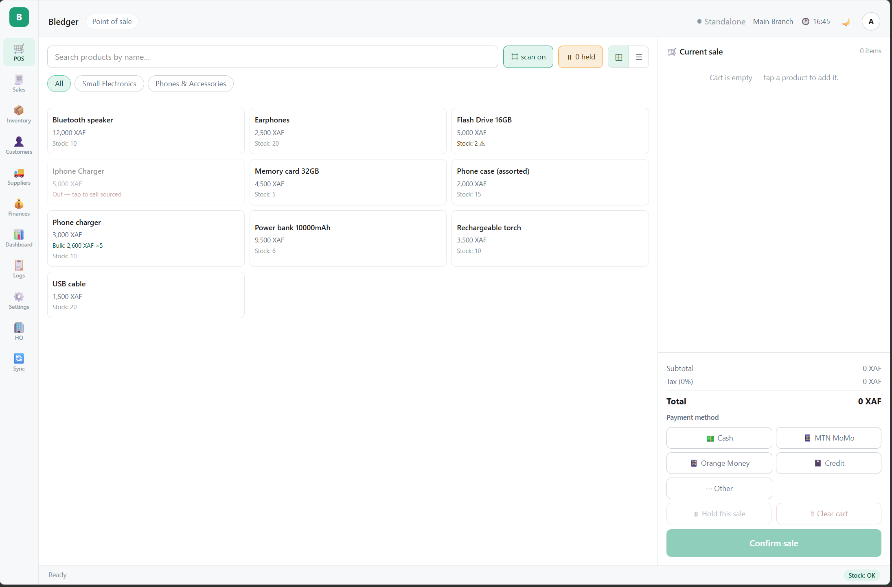
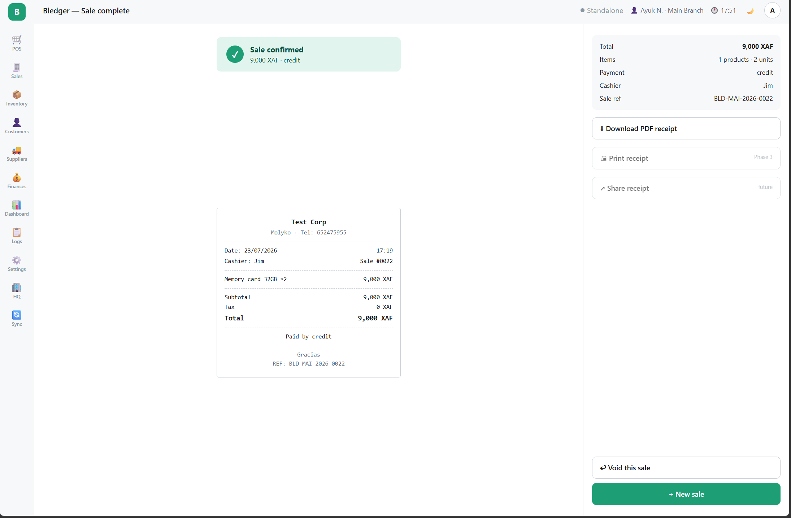
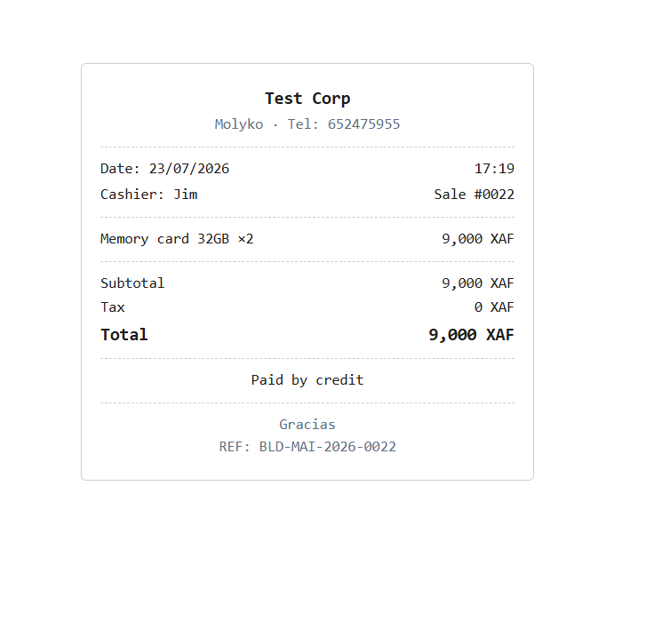
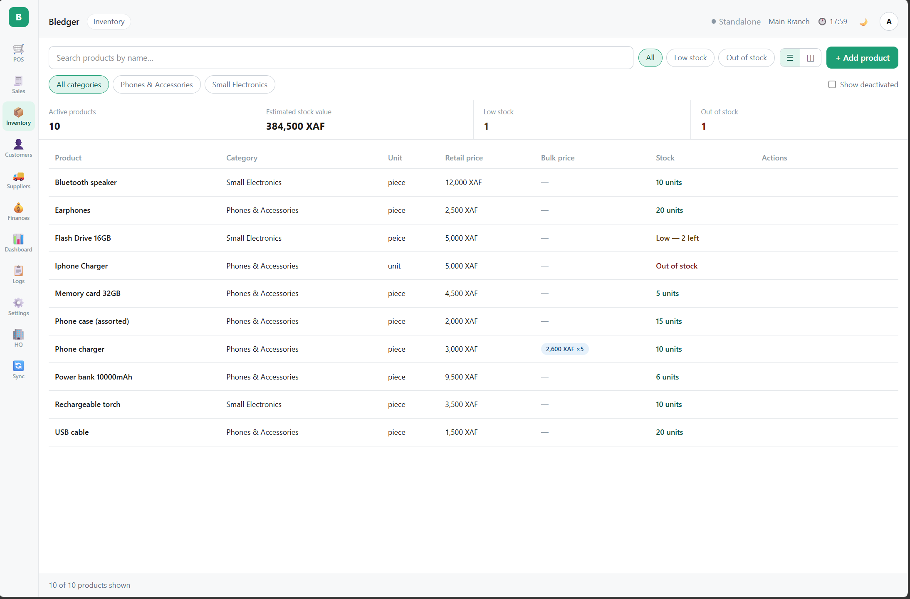
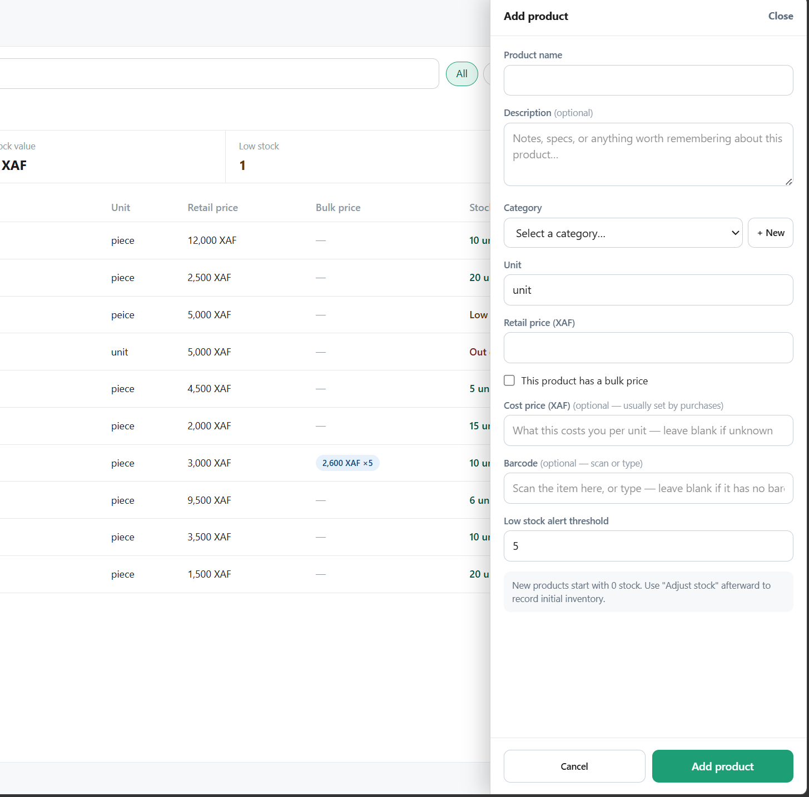

# Bledger — User Guide

*For shop owners, managers, and cashiers. No technical knowledge needed.*

---

## What Bledger is

Bledger is your shop's **till, stock book, and sales record in one app**. It runs
on the shop's own computer and works **completely offline** — no internet is
needed for daily use. Prices are in **XAF (francs)**, whole numbers only, the way
you actually price things. It's built for the way shops here really work:

- **It never stops when the network does.** Every sale is saved on the device the
  moment you make it. You can trade all day with no internet and lose nothing.
- **Haggling is normal.** Bledger records the marked price *and* the price the
  customer actually paid, so your books stay honest even when you negotiate.
- **Mobile Money is built in.** Cash, MTN MoMo, and Orange Money are all
  first-class — with reference capture and confirmation for MoMo.
- **"Na go pay you Friday" is a real transaction.** Customer accounts and credit
  let you record what's owed and track it down.

If you have several shops, Bledger also runs in a **connected** mode: each branch
works on its own, and the owner sees every branch together from one dashboard.
Everything below applies to a single shop; the multi-branch parts are noted at
the end.

*The Point of Sale screen — product grid with categories on the left, the current
sale and payment methods on the right.*

---

## 1. Who can do what

Bledger has three kinds of accounts:

| | Owner | Manager | Cashier |
|---|---|---|---|
| Sell at the POS | ✅ | ✅ | ✅ |
| See sales history | ✅ | ✅ | ✅ (own sales only) |
| View stock levels | ✅ | ✅ | ✅ (view only) |
| Add/edit products, adjust stock | ✅ | ✅ | ❌ |
| Void (cancel) a sale | ✅ | ✅ | ❌ |
| Suppliers & purchases | ✅ | ✅ | ❌ |
| Customers & credit | ✅ | ✅ | ❌ |
| Expenses & cashbook | ✅ | ✅ | ❌ |
| Dashboard (revenue, reports) | ✅ | ✅ | ❌ (stock alerts only) |
| Create staff accounts | ✅ | ❌ | ❌ |

Owners and managers log in with a **username and password**. Cashiers log in with
a **4-digit PIN** — fast enough for shift changes at the till.

---

## 2. First-time setup

The first time Bledger opens on a new install, it walks you through a 3-step
wizard:

1. **Business** — your business name, branch name, address, phone, and the
   message printed at the bottom of receipts.
2. **Products** — optionally pick a starter template (Provision Store, Boutique,
   Cosmetics, or Electronics) to pre-load common products and categories. You can
   skip this and add products yourself later.
3. **Account** — create the owner account: your name, username, and password, plus
   an optional 4-digit PIN for quick access.

When you finish, you're logged in as the owner and ready to sell. The wizard only
runs once — after that the app always opens at the login screen.

*First run asks whether this is a brand-new business or a branch of one you
already run.*

*Step 1 of the wizard: your business details, which appear on receipts and
reports.*

### Adding staff

Only the owner can create staff accounts. A **cashier** needs a name, username,
and a 4-digit PIN. A **manager** needs a name, username, and password.

---

## 3. Logging in and out

- **Owner / Manager:** enter your username and password.
- **Cashier:** enter your username, then your 4-digit PIN on the keypad.

To log out, open the user menu in the top bar and choose log out. **Always log out
when handing the till to someone else** — every sale is recorded under whoever is
logged in.

---

## 4. Making a sale (POS)

1. Open **POS** from the navigation rail.
2. Tap products in the grid to add them to the cart. Tap again (or use + / − in
   the cart) to change quantities. Out-of-stock products can't be sold.
3. **Bulk prices apply automatically** — if a product has a bulk price and the
   quantity reaches the bulk minimum, the lower price is used. You do nothing.
4. **Scan a barcode** instead of tapping, if you have a scanner — a USB scanner
   works out of the box, and there's a camera-scan option too.
5. **Negotiated a price?** Adjust the line price for the haggled amount. Bledger
   records the difference (the *variance*) against the marked price. If the
   discount or surplus goes beyond what the shop allows, a manager PIN approves it.
6. Choose the payment method: **Cash**, **MTN MoMo**, **Orange Money**, or
   **Other**. For Mobile Money, enter the **transaction reference** from the
   customer's phone and tick **"Payment confirmed on phone"** — the sale can't
   complete without both, which protects you from fake payment screens.
7. Complete the sale. Stock is reduced immediately and the receipt opens.

### Holding a sale

If a customer steps away mid-sale, use **Hold** — the cart is saved with an
optional label (e.g. "Woman in red dress") so you can serve the next customer.
Restore it later from the held-sales drawer. Held sales disappear once restored.

### If the sale won't complete

- *"Insufficient stock"* — someone bought the last units while this cart was
  open. Adjust the quantity.
- *Mobile Money fields missing* — enter the reference and tick the confirmation
  box.

---

## 5. Receipts

After each sale the receipt screen shows the sale with its reference number (e.g.
**BLD-MAI-2026-0022**). Print it or download it as an 80mm PDF (made for receipt
printers). Give customers the reference for any later questions.

*The sale-complete screen: a summary, the receipt preview, and options to
download the PDF, void the sale, or start a new one.*

*The 80mm receipt, sized for thermal receipt printers.*

---

## 6. Sales history

Open **Sales** to see past sales. Filter by date range, payment method, and
status, or search by reference. Cashiers see only their own sales; managers and
owners see everything.

### Voiding (cancelling) a sale — manager/owner only

If a sale was a mistake, open it and choose **Void**. You must give a reason.
Voiding puts the stock back and removes the sale from revenue, but the record is
kept permanently, marked "Voided", with who voided it and why. A sale can be
voided only once, and voids can't be undone.

---

## 7. Inventory (stock)

Open **Inventory** to see all products, prices, and stock levels. Each product
shows a status: **OK**, **Low** (at or below its alert threshold), or **Out**.

Managers and owners can:

- **Add a product** — name, category, unit, retail price, optional bulk price and
  minimum quantity (set together), low-stock threshold, and barcode.
- **Edit a product** — prices, category, threshold, etc. **Stock level can never
  be typed in directly** — it only moves through adjustments, sales, and
  purchases, so the record stays honest.
- **Adjust stock** — *Add* (restock), *Remove* (damage, expiry), or *Correction*
  (count discrepancy). A reason is always required. Every adjustment is saved
  permanently with before/after quantities and who made it — your audit trail.
- **Deactivate a product** — products are never deleted, so old receipts stay
  correct. A deactivated product leaves the POS but stays in history and can be
  reactivated.

Cashiers can see everything here but can't change anything.

*The Inventory screen: products, prices, and stock, with totals for active
products, stock value, low stock, and out of stock across the top.*

*Adding a product from the side drawer. New products start at zero stock — record
the opening quantity afterward with "Adjust stock".*

---

## 8. Suppliers & purchases (manager/owner only)

Open **Suppliers** to keep a directory of who you buy from and a record of every
purchase.

- **Add a supplier** — name, phone, area, notes. Suppliers can be deactivated and
  reactivated.
- **Record a purchase** — pick the supplier, date, and products (quantity and
  unit cost). Recording a purchase **automatically adds the stock** — no separate
  adjustment needed.
- **Payment tracking** — enter what you paid at the time; the purchase is marked
  **Paid**, **Partial**, or **Credit** automatically. For partial/credit, use
  **Record payment** later to log each installment; the balance owed and full
  payment history are kept per purchase.

A recorded purchase can't be edited or deleted — like a sale, it's a permanent
financial record.

### Purchase orders

Under the **Purchase orders** tab you can raise an order to a supplier *before*
the goods arrive: create a draft, send it, then **receive** it fully or partially
when stock comes in. Receiving turns the order into a purchase and adds the stock
through the same trusted path. A purchase order on its own never changes stock —
only receiving does.

---

## 9. Customers & credit (manager/owner only)

Open **Customers** to keep a directory of regulars and manage credit.

- **Add a customer** — name, phone, area, and an optional **credit limit**.
- **Sell on credit** — attach a customer to a sale so what they owe is tracked.
- **Record a payment** — log installments as customers pay down their balance. The
  balance is always the sum of the ledger, so it's never guesswork.
- **Aged debt** — see who owes what and for how long, so you know who to chase.

---

## 10. Expenses & cashbook (manager/owner only)

Open **Finances** to record money going out that isn't a supplier purchase — rent,
transport, electricity, wages — under expense categories. The cashbook gives you a
simple money-in / money-out view, and a **profit & loss** summary brings sales,
costs, and expenses together.

---

## 11. Dashboard (manager/owner)

Open **Dashboard** for the business overview, switchable between **Today**, **This
week**, and **This month**:

- Revenue, number of sales, and average sale — each compared to the previous
  period.
- Sales chart (by hour for today, by day for week/month).
- Payment breakdown — Cash vs MTN MoMo vs Orange Money.
- Top products by revenue.
- **Variance** — how much you gave away in discounts and collected in surplus,
  broken down per cashier.
- **Margin** and stock valuation — what your stock is worth and where margins are
  thin.
- **Stock alerts** — products at or below their low-stock threshold. This is the
  one dashboard item cashiers can also see.
- Exportable reports (sales, products, stock).

Voided sales never appear in any dashboard figure.

> *Screenshot to add: the owner Dashboard with its KPIs, sales chart, payment
> breakdown, and top products.*

---

## 12. If you have several shops (multi-branch)

When Bledger is set up in connected mode, each branch runs on its own and keeps
working offline; changes sync to head office automatically whenever there's
internet. As an owner you get two extra things:

- **HQ dashboard** — every branch's revenue and activity in one place, with each
  branch's last-synced time.
- **Sync health** — a view of anything that hasn't synced yet, so nothing goes
  missing quietly.

A small badge in the top bar always shows the sync state (synced, syncing,
offline, or standalone). You never wait on it to make a sale.

---

## 13. Good habits

- Log out (or switch cashier) at every shift change.
- Never share PINs or passwords.
- Only tick "Payment confirmed on phone" after seeing the confirmation on **your**
  phone, not the customer's screen.
- Give a clear reason for every stock adjustment and void — future you will thank
  present you.
- Check stock alerts daily so you restock before running out.
- Attach the customer to credit sales, and record payments as they come in, so the
  balance owed is always right.
